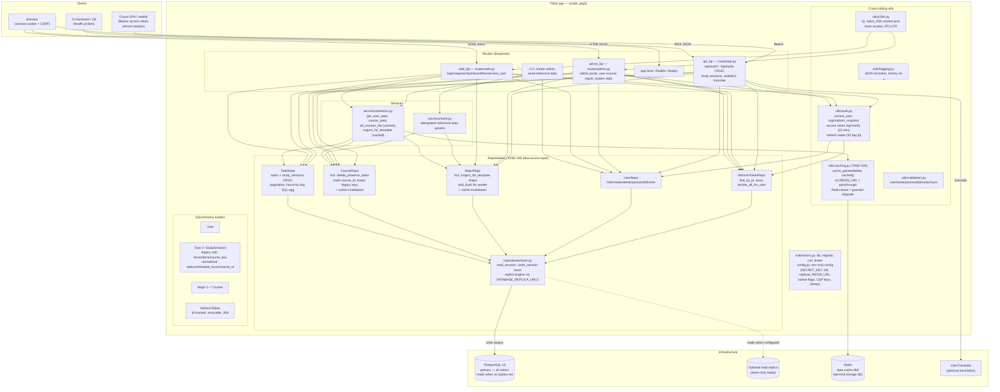
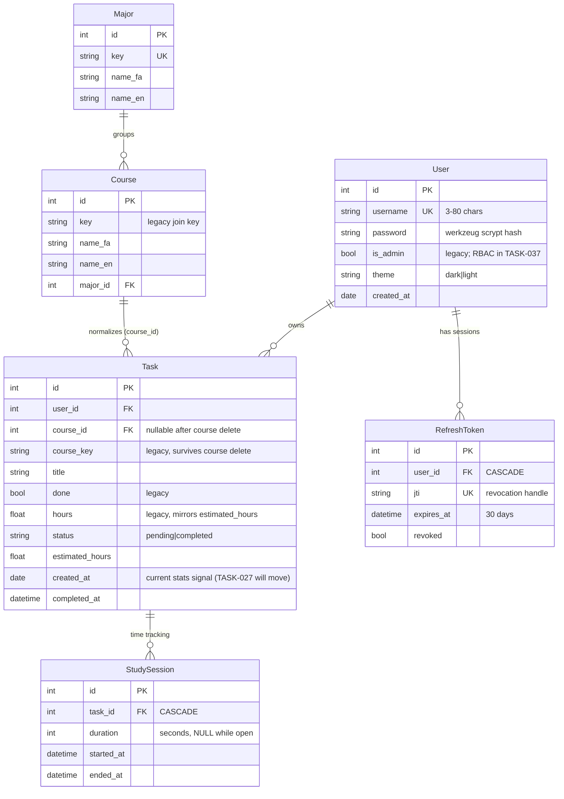
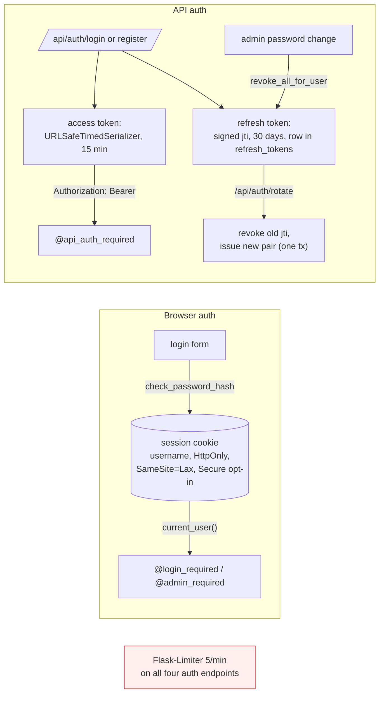
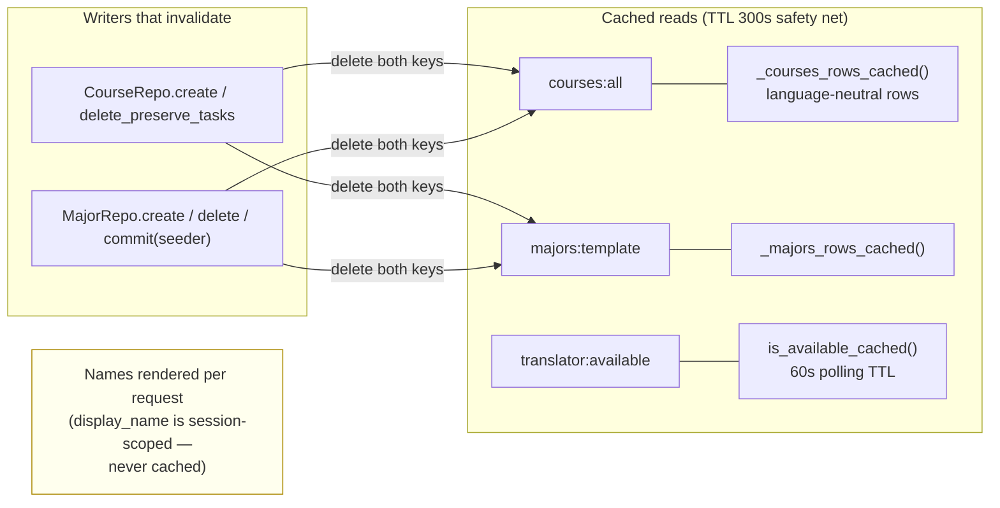
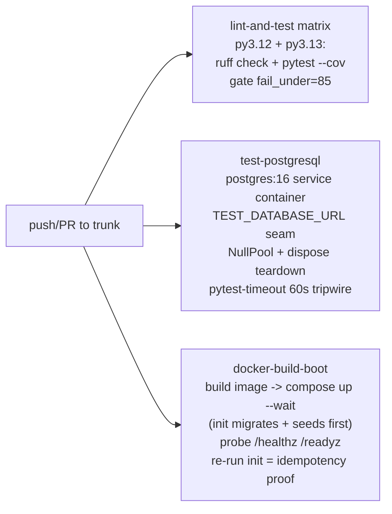
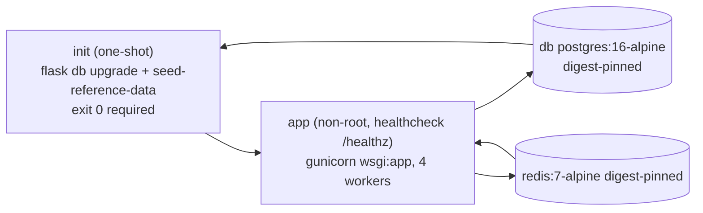

# Study Planner — Knowledge Graph

Generated 2026-08-24 from `trunk` @ 688d987. Layers read top → bottom:
request entry points (routes) → business logic (services) → data access
(repositories) → ORM models → PostgreSQL. Cross-cutting concerns on the
right. Tests mirror the layer they cover.

## System architecture

## Data model + ownership rules

**Legacy-column rule** (CLAUDE.md): `hours`↔`estimated_hours` and
`course_key` stay written together until an explicit migration drops them.
Course deletion nulls `course_id` but keeps `course_key` on task rows.

## Auth flows

## Caching + invalidation map (TASK-025)

## CI pipeline

## Deployment topology (compose)

## Layer dependency rules (enforced by convention)

1. **Routes never touch** `db.session` / `Model.query` — repositories only.
   Exception: `utils/auth.py` auth-state lookups (documented).
2. **Writes go through repos** → invalidation hooks live at the data layer,
   so routes cannot forget to bust caches.
3. **Mutate-after-read**: anything you will modify must load via
   `*Repo.get_for_write(...)` — reads may come from a replica session.
4. **Cache stores language-neutral rows**; names render per request.
5. **No auto table creation** outside tests (`db.create_all()` is
   test-fixture only); schema changes only via Alembic migrations.

## Test coverage map (259 tests)

| Test file | Covers |
|---|---|
| test_repositories.py | All five repos, CRUD + pagination + aggregation |
| test_replication_seam.py | Read/write split wiring, mutate-under-replica persistence |
| test_caching.py | Hit/miss/invalidation/TTL, dead-Redis degradation |
| test_routes_api.py | Full `/api/*` contract incl. refresh rotation |
| test_routes_web.py / admin.py | Browser flows incl. RBAC boundary (is_admin) |
| test_security_headers.py | Headers, CSP contents, cookie flags |
| test_rate_limiting.py | 5/min throttle behavior |
| test_cli.py | create-admin + seeding |
| test_health.py, test_logging.py | Probes, JSON logs, Sentry init |
| test_models/services/utils.py | Domain logic |

## Open roadmap (what the graph will grow)

- **TASK-027**: stats signal `Task.hours@created_at` → `StudySession.duration@started_at`
  (decision parked: backfill vs reset)
- **TASK-037/038**: RBAC roles/permissions replacing `is_admin`
- **TASK-035/036**: logging DB + audit trail hooking repos
- **TASK-026**: `/api/me`, `/api/courses`, logout endpoints
- **TASK-032**: Next.js/shadcn frontend consuming the same API
